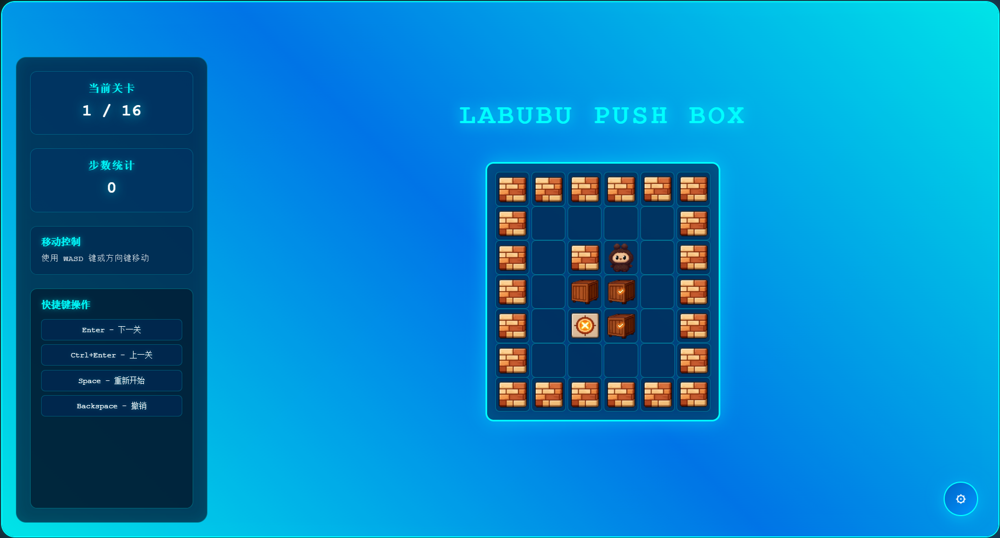
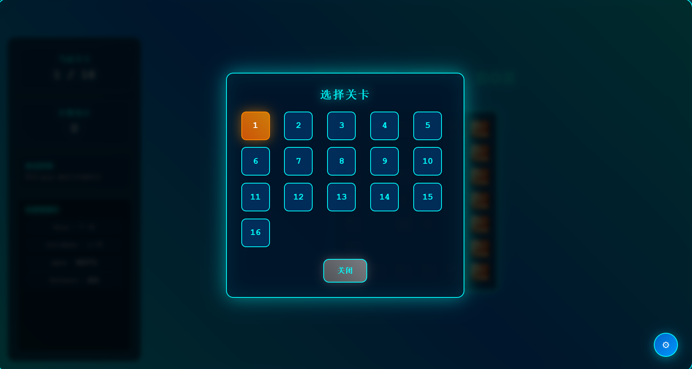
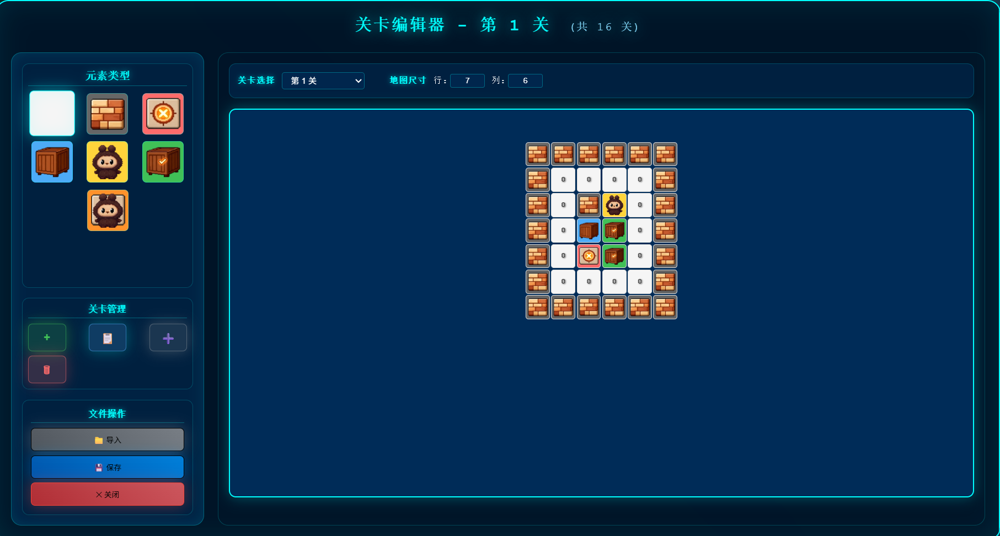
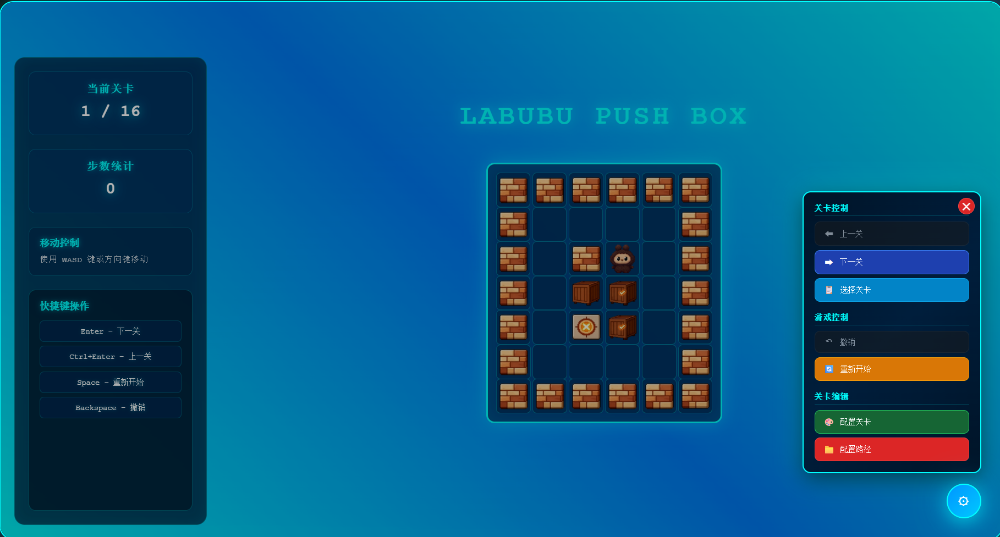

<div align="center">

# 🎮 Selulu 推箱子

### Push Box Game Desktop

**经典推箱子益智游戏 · 桌面版**

一款赛博朋克风格的推箱子桌面游戏，基于 Electron + Vue 3 构建

内置 18 个精心设计的关卡 + 可视化关卡编辑器，创建属于你自己的挑战！

[](https://github.com/yuyong123-lang/push-box-game-desktop)
[](https://vuejs.org/)
[](https://www.electronjs.org/)
[](https://vitejs.dev/)
[](LICENSE)

[开始使用](#-快速开始) · [功能特性](#-功能特性) · [在线体验](https://github.com/yuyong123-lang/push-box-game)

</div>

---

## ✨ 亮点一览

```
🧩 18 个内置关卡        从入门到烧脑，逐步挑战你的空间思维
🔄 无限撤销             走错了？随时回退，没有次数限制
🎨 可视化关卡编辑器      拖拽设计关卡，发挥你的创意
📂 自定义关卡导入        导入 JSON 文件，玩别人设计的关卡
🕹️ 流畅的键盘操控       WASD / 方向键，快捷键一应俱全
🌃 赛博朋克视觉风格      霓虹光效 + 动态边框动画
🖥️ 一键安装             双击安装包，选择目录，即刻开玩
```

## 📸 游戏截图

<table>
  <tr>
    <td align="center"><b>🎯 游戏界面</b></td>
    <td align="center"><b>📋 关卡选择</b></td>
  </tr>
  <tr>
    <td></td>
    <td></td>
  </tr>
  <tr>
    <td align="center"><b>⚙️ 路径配置</b></td>
    <td align="center"><b>🛠️ 工具栏</b></td>
  </tr>
  <tr>
    <td></td>
    <td></td>
  </tr>
</table>

## 🎯 功能特性

### 🕹️ 核心玩法
- 经典推箱子规则 — 推动箱子到所有目标位置即可过关
- **18 个内置关卡**，涵盖不同地图尺寸，难度循序渐进
- **无限撤销** — 走错不怕，随时回退到任意历史步骤
- 自动通关检测 + 精彩的过关动画
- 通关倒计时自动跳转下一关，体验流畅

### 🎨 关卡编辑器
- 全功能可视化关卡设计工具，所见即所得
- **7 种地图元素**：空地、墙壁、目标点、箱子、玩家等
- 支持拖拽操作 — 从面板拖入元素、网格内移动元素
- 地图尺寸可调（3×3 ~ 12×12）
- 关卡管理：新增 / 复制 / 插入 / 删除
- 支持导入外部 `levels.json` 文件
- 一键保存关卡到本地

### 📂 自定义关卡
- 支持配置自定义关卡文件路径
- 文件路径连通性测试
- 配置自动持久化，下次打开无需重新设置

### 🖥️ 桌面集成
- NSIS 安装向导，**自由选择安装目录**
- 自动创建桌面快捷方式 + 开始菜单快捷方式
- 安装完成即可启动
- 关卡数据独立存储于用户数据目录，升级不丢失

## ⌨️ 键盘操作

| 按键 | 功能 | 说明 |
|:---:|:---:|:---|
| `W` / `↑` | ⬆️ 上移 | 向上推动箱子 |
| `S` / `↓` | ⬇️ 下移 | 向下推动箱子 |
| `A` / `←` | ⬅️ 左移 | 向左推动箱子 |
| `D` / `→` | ➡️ 右移 | 向右推动箱子 |
| `Enter` | ⏭️ 下一关 | 跳转到下一关 |
| `Ctrl + Enter` | ⏮️ 上一关 | 返回上一关 |
| `Alt + Enter` | 📋 关卡选择 | 打开关卡选择面板 |
| `Space` | 🔄 重来 | 重新开始当前关卡 |
| `Alt + Space` | ✏️ 编辑器 | 打开/关闭关卡编辑器 |
| `Backspace` | ↩️ 撤销 | 撤销上一步操作 |

## 🛠️ 技术栈

| 技术 | 版本 | 说明 |
|---|---|---|
| [Vue 3](https://vuejs.org/) | 3.x | 前端框架，Composition API + `<script setup>` |
| [Vite](https://vitejs.dev/) | 7.x | 下一代前端构建工具 |
| [Electron](https://www.electronjs.org/) | 35.x | 跨平台桌面应用框架 |
| [electron-builder](https://www.electron.build/) | 26.x | 应用打包与分发 |
| [@vueuse/motion](https://motion.vueuse.org/) | 3.x | Vue 动画库 |

## 📁 项目结构

```
push-box-game-desktop/
├── 📂 electron/
│   ├── main.js              # Electron 主进程
│   └── preload.js           # 预加载脚本（IPC 桥接）
├── 📂 src/
│   ├── App.vue              # 根组件
│   ├── main.js              # 入口文件
│   ├── style.css            # 全局样式（赛博朋克风格）
│   ├── 📂 components/
│   │   ├── GameBoard.vue    # 游戏棋盘渲染
│   │   ├── GameInfoPanel.vue# 左侧信息面板
│   │   ├── SuccessModal.vue # 通关弹窗
│   │   ├── LevelSelector.vue# 关卡选择器
│   │   ├── LevelEditor.vue  # 关卡编辑器
│   │   ├── PathConfig.vue   # 关卡路径配置
│   │   ├── Toolkit.vue      # 浮动工具栏
│   │   └── Notification.vue # 消息通知
│   └── 📂 composables/
│       └── useGameState.js  # 游戏核心状态管理
├── 📂 public/
│   ├── levels.json          # 内置关卡数据（18关）
│   └── 📂 images/           # 游戏素材图片
├── 📂 screenshots/          # README 截图
├── index.html
├── vite.config.js
├── electron-builder.yml
└── package.json
```

## 🚀 快速开始

### 环境要求

- [Node.js](https://nodejs.org/) >= 18
- npm >= 8

### 安装依赖

```bash
git clone https://github.com/yuyong123-lang/push-box-game-desktop.git
cd push-box-game-desktop
npm install
```

### 开发模式

```bash
npm run dev
```

启动后同时运行 Vite 开发服务器和 Electron 窗口，支持热更新。

### 构建安装包

```bash
npm run electron:build
```

构建完成后，安装包位于 `release/push-box-game-1.0.0-setup.exe`，双击即可安装。

## 🗺️ 地图元素

| 编码 | 元素 | 图示 | 说明 |
|:---:|:---:|:---:|:---|
| 0 | 空地 | ⬜ | 可通行区域 |
| 1 | 墙壁 | 🧱 | 不可通行，不可推动 |
| 2 | 目标点 | 🎯 | 箱子需要被推到的位置 |
| 3 | 箱子 | 📦 | 可被玩家推动 |
| 4 | 玩家 | 👤 | 玩家角色 |
| 5 | 箱子在目标上 | ✅ | 箱子已到达目标位置 |
| 6 | 玩家在目标上 | 🧑‍🎯 | 玩家站在目标位置上 |

## 📦 关卡数据格式

关卡文件为 JSON 格式，你可以创建自己的关卡文件并导入：

```json
{
  "levels": [
    [
      [1, 1, 1, 1, 1],
      [1, 4, 0, 3, 1],
      [1, 0, 2, 0, 1],
      [1, 1, 1, 1, 1]
    ]
  ],
  "timestamp": "2025-09-16T09:10:32.285Z"
}
```

## 💻 安装与卸载

### 安装

1. 双击 `push-box-game-1.0.0-setup.exe`
2. 按照安装向导提示操作
3. 可选择自定义安装目录
4. 安装完成后可选择立即启动

### 卸载

- 通过 Windows **设置 → 应用** 卸载
- 或通过 **控制面板 → 程序和功能** 卸载

---

<div align="center">

**如果这个项目对你有帮助，请给个 ⭐ Star 支持一下！**

Web 版本：[push-box-game](https://github.com/yuyong123-lang/push-box-game)

</div>
